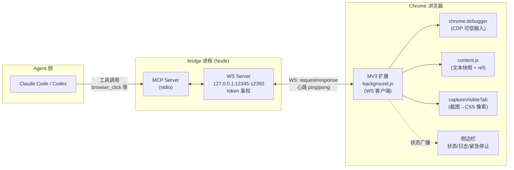
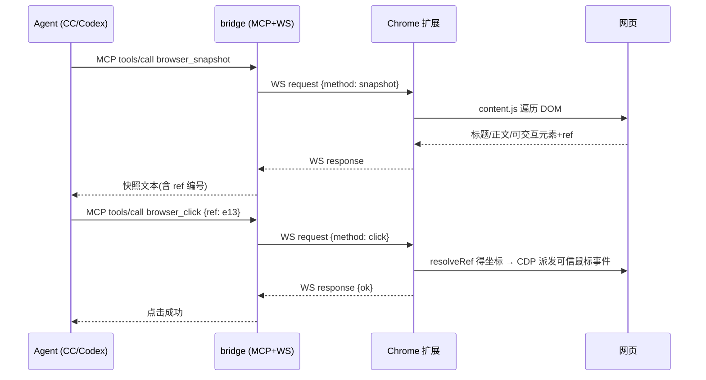

# Agent Use Chrome

让 **Claude Code / Codex 等 agent** 驱动你本机的 Chrome 浏览器:agent 通过 MCP 调用 bridge 进程,bridge 通过 WebSocket 把指令发给 Chrome MV3 扩展,扩展用 **CDP(chrome.debugger)** 注入可信输入、生成文本快照和截图。全程使用你真实的浏览器与登录态。

参考 [dsh-use-chrome](https://github.com/hanhuizhu/dsh-use-chrome) 的桥接思路,做了三点增强:MCP 协议接入(CC/Codex 通用)、混合状态(文本快照 + 按需截图)、CDP 可信输入。

## 工作原理



一次 `browser_click` 的完整链路:



### 端口协商(免配置)

- **bridge**:启动时在 **12345 → 12350** 端口段内**从小到大**抢占第一个空闲端口。
- **extension**:按**同一顺序**逐个端口探测(单端口 1.5s 超时),连上谁就是谁;断开后指数退避自动重扫。
- 两端无需手工对齐端口。需要固定端口时,给 bridge 设 `BRIDGE_PORT` 环境变量即可(此时扩展扫描段外的端口需自行保证一致)。

### 设计要点

- **坐标系统一为 CSS 像素**:快照元素几何、截图(已降采样)、CDP 点击坐标三者一致,agent 可直接互换使用。
- **文本快照优先**:`browser_snapshot` 返回带 ref 编号的可交互元素列表,比截图便宜得多;需要视觉理解时再 `browser_screenshot`。
- **可信输入**:点击/键盘经 CDP 注入,`isTrusted === true`,不易被前端框架忽略。
- **stdout 纪律**:bridge 的 stdout 被 MCP stdio 占用,所有日志走 stderr。

## 目录结构

```
agent-use-chrome/
├── bridge/          # Node + TS:对 agent 开 stdio MCP,对扩展开 localhost WS
│   ├── src/
│   │   ├── index.ts        # 入口:端口段抢占 + 启动 MCP/WS
│   │   ├── ws-server.ts    # WS server:鉴权、心跳、请求-响应配对
│   │   ├── mcp-server.ts   # 10 个 browser_* MCP 工具定义
│   │   ├── protocol.ts     # 双端消息协议与常量(含端口段)
│   │   └── image.ts        # 截图处理
│   └── dist/               # 构建产物
├── extension/       # Chrome MV3 扩展
│   ├── background.js       # WS 客户端(端口扫描)、CDP 执行、指令分发
│   ├── content.js          # 文本快照、ref 解析
│   ├── manifest.json
│   └── panel/              # 侧边栏:状态(2s 轮询)、token 配置、日志、紧急停止
└── skills/chrome/   # Claude Code skill:教 agent 如何用这套工具干活
```

## 安装使用

### 1. 构建 bridge

```bash
cd bridge
npm install
npm run build
```

### 2. 加载 Chrome 扩展

1. Chrome 打开 `chrome://extensions`,开启「开发者模式」。
2. 「加载已解压的扩展程序」,选择 `extension/` 目录。
3. 点击扩展图标打开侧边栏。端口自动扫描 12345-12350,只需确认 token(默认 `local-dev-token`)。

### 3. 注册 MCP 到 agent

**Claude Code**(推荐用户级作用域,任何目录可用):

```bash
claude mcp add -s user chrome-bridge -- node /绝对路径/agent-use-chrome/bridge/dist/index.js
```

**Codex**(`~/.codex/config.toml`):

```toml
[mcp_servers.chrome-bridge]
command = "node"
args = ["/绝对路径/agent-use-chrome/bridge/dist/index.js"]
```

> 注册后需**重启 agent 会话**:MCP server 只在会话启动时加载,bridge 随之作为子进程被拉起并开始监听端口。

### 4. 安装 skill(可选,Claude Code)

```bash
mkdir -p ~/.claude/skills/chrome
cp skills/chrome/SKILL.md ~/.claude/skills/chrome/
```

之后可以直接说「用 chrome 打开百度搜索 xxx」或 `/chrome`,agent 会按 skill 中的最佳实践(先快照后动作、ref 优先、动作后验证)操作浏览器。

### 5. 验证

1. 重启 CC 后,扩展侧边栏应显示「已连接 :12345」(或段内其他端口)。
2. 对 agent 说:「打开 https://example.com 并截图」。
3. 浏览器自动导航,agent 返回截图 —— 链路打通。

## 侧边栏聊天（extension 驱动）

侧边栏「聊天」Tab 可以直接与任意 Claude Code 会话对话——插件不调度任何 LLM，CC 就是大脑。**无需 CC 预先进入任何模式**：面板发消息即触达。

```
panel(chat) ⇄ background ⇄ WS ⇄ bridge ⇄ spawn claude CLI（headless resume）
```

- 下拉列出最近 30 个 CC 会话（跨项目，按活跃时间倒序），也可「＋新会话」并选择项目目录
- bridge 以 `claude --resume <id> -p <消息> --output-format stream-json --include-partial-messages` headless 执行，回复**流式打字**渲染（markdown 支持代码块/列表/粗体），工具调用折叠为卡片可展开
- **忙时排队**：同一时间全局只有一个进行中轮次；期间发的消息带「⏳ 排队中」标签，当前轮次结束后自动续发。「■ 停止」终止当前轮次并清空队列
- 「＋新会话」连发多条也会归入同一新会话（bridge 自动续接首轮返回的 session id）
- 权限模式收纳在「⚙」设置里：默认 / acceptEdits / bypassPermissions（bypass 有红色警示，慎用）；headless 下未预授权的工具会被拒绝（默认模式），CC 会说明或绕过
- 需要 `claude` CLI 在 PATH 中且**登录态有效**（若长期只用桌面端，CLI 的 OAuth token 可能过期，面板会提示；任意终端跑一次 `claude` 重新登录即可）
- 对**正开在终端里的会话**发消息可能造成历史分叉，设置面板有提示

## MCP 工具一览

| 工具 | 说明 |
|---|---|
| `browser_navigate` | goto / back / forward / reload |
| `browser_snapshot` | 结构化文本快照(标题、正文摘要、编号可交互元素 + ref) |
| `browser_screenshot` | 可视区截图(降采样到 CSS 像素) |
| `browser_click` | 按 ref 或 x/y 点击 |
| `browser_type` | 向输入框输入文本,可清空 / 回车提交 |
| `browser_press_key` | Enter / Tab / Escape / 方向键等 |
| `browser_scroll` | 上下左右滚动 |
| `browser_wait` | 固定等待 / 等页面加载完成 |
| `browser_tabs` | list / new / select / close |
| `browser_get_state` | 当前 URL / 标题 / 状态 |

## 常见问题

| 现象 | 原因与处理 |
|---|---|
| 侧边栏一直「未连接」 | bridge 没在运行。MCP 注册后必须重启 agent 会话;或手动 `node bridge/dist/index.js` 验证 |
| 曾经显示「未连接」但实际在干活 | 旧版竞态 bug,已修复:侧边栏现在每 2s 轮询真实状态 |
| 报「候选端口全部不可用」 | 12345-12350 被占满,释放端口或用 `BRIDGE_PORT` 指定 |
| 「该标签已打开 DevTools」 | CDP 与 DevTools 互斥,关闭该标签的开发者工具 |
| 面板报「OAuth session expired」 | CLI 登录态过期,在终端运行一次 `claude` 重新登录 |
| 页面顶部「正在调试此浏览器」横幅 | CDP attach 的正常现象 |

## 安全说明

- WS 仅绑定 `127.0.0.1`,带 token 鉴权,不暴露局域网。
- 扩展对 agent **免确认执行**且拥有对活动标签的完全控制——**请仅在可信环境 / 专用 Chrome profile 使用**。
- 侧边栏「紧急停止」立即断开连接、detach 所有标签,且不再自动重连(直到手动「保存并重连」)。
